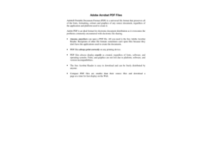

# PixStor Search Plugin

**Name:** document_thumbnail.py

**Author(s):** Chris Oates

**Version:** 3.0

**Last Updated:** 2019/05/21

## About This Plugin

This plugin generates thumbnail and preview images for document file formats - including PDF and Word

## Deprecated and Removed

This plugin used `unoconv` to generate its thumbnails. However, this command has been observed to fail (become 'defunct'), causing ingest to hang indefinitely.

As such, this plugin has been removed, and we recommended it be deleted from any system it has been installed on.
Any issues relating to the continued use of this plugin are considered unsupported.

## License

This plugin is licensed under the MIT License

Copyright 2019 Pixit Media Limited

Permission is hereby granted, free of charge, to any person obtaining a copy of this software and associated documentation files (the "Software"), to deal in the Software without restriction, including without limitation the rights to use, copy, modify, merge, publish, distribute, sublicense, and/or sell copies of the Software, and to permit persons to whom the Software is furnished to do so, subject to the following conditions:

The above copyright notice and this permission notice shall be included in all copies or substantial portions of the Software.

THE SOFTWARE IS PROVIDED "AS IS", WITHOUT WARRANTY OF ANY KIND, EXPRESS OR IMPLIED, INCLUDING BUT NOT LIMITED TO THE WARRANTIES OF MERCHANTABILITY, FITNESS FOR A PARTICULAR PURPOSE AND NONINFRINGEMENT. IN NO EVENT SHALL THE AUTHORS OR COPYRIGHT HOLDERS BE LIABLE FOR ANY CLAIM, DAMAGES OR OTHER LIABILITY, WHETHER IN AN ACTION OF CONTRACT, TORT OR OTHERWISE, ARISING FROM, OUT OF OR IN CONNECTION WITH THE SOFTWARE OR THE USE OR OTHER DEALINGS IN THE SOFTWARE.
