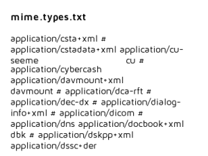

# PixStor Search Plugin

**Name:** text_thumbnail.py

**Author(s):** Chris Oates

**Version:** 2.0

**Last Updated:** 2019/02/12


## About This Plugin

This plugin generates thumbnail and preview images for plain text files.
The thumbnails display a section of the file's text.




## Installing This Plugin

1. Copy the plugin to your designated plugins/ directory. On a PixStor4 system, this defaults to `/opt/arcapix/usr/share/apsearch/plugins`

2. Restart the `apsearch-middleware` service:

```
systemctl restart apsearch-middleware
```

3. (Re)ingest content as required - existing data will not be automatically rescanned

4. Additional requirements

This plugin requires external font files. Sample fonts are included in this repo, but they can be replaced with any preferred TrueType font

To use the `HtmlTextThumbnail` plugin, you will need [BeautifulSoup](https://www.crummy.com/software/BeautifulSoup)

```
pip install bs4
```


## Using This Plugin

The generated thumbnails are very barebones, black text on white background images. The plugin can be adapted to provide your own styling.

The TextThumbnail plugin can be subclassed to generate similar thumbnails for other formats.
Such subclasses just need to provide a `_get_text` method, which extracts some text, and returns it as a string.
This file includes an example subclass, which extracts text from html files.

Note - there is a HTMLThumbnail - also available in this repo - which can generate proper, rendered thumbnails for html files.


## License

This plugin is licensed under the MIT License

Copyright 2018 Pixit Media Limited

Permission is hereby granted, free of charge, to any person obtaining a copy of this software and associated documentation files (the "Software"), to deal in the Software without restriction, including without limitation the rights to use, copy, modify, merge, publish, distribute, sublicense, and/or sell copies of the Software, and to permit persons to whom the Software is furnished to do so, subject to the following conditions:

The above copyright notice and this permission notice shall be included in all copies or substantial portions of the Software.

THE SOFTWARE IS PROVIDED "AS IS", WITHOUT WARRANTY OF ANY KIND, EXPRESS OR IMPLIED, INCLUDING BUT NOT LIMITED TO THE WARRANTIES OF MERCHANTABILITY, FITNESS FOR A PARTICULAR PURPOSE AND NONINFRINGEMENT. IN NO EVENT SHALL THE AUTHORS OR COPYRIGHT HOLDERS BE LIABLE FOR ANY CLAIM, DAMAGES OR OTHER LIABILITY, WHETHER IN AN ACTION OF CONTRACT, TORT OR OTHERWISE, ARISING FROM, OUT OF OR IN CONNECTION WITH THE SOFTWARE OR THE USE OR OTHER DEALINGS IN THE SOFTWARE.
